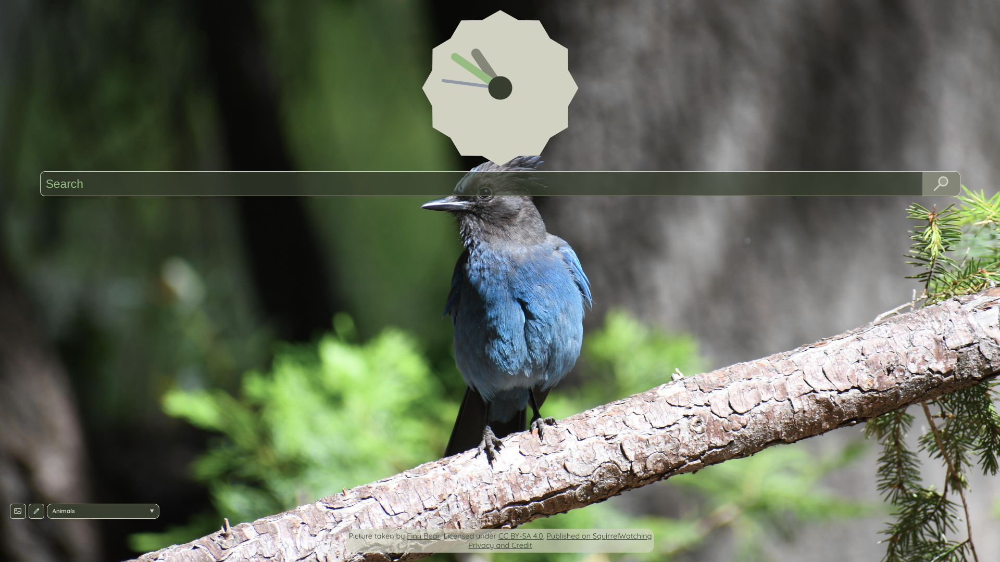
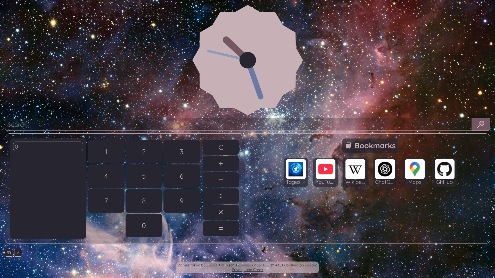

# CTRL+N

## Custom tilable page for a new tab in a browser

## ** ⚠️ CTRL+N is currently in an early beta state – Breaking changes may occur at any time ⚠️ **

	
	

Screenshots might not be fully up to date

---

## Features

- Vertical and horizontal tiling
- An always-growing list of widgets to choose
- A long list of preset search engines *(custom ones will come soon)*

## How to use?

There are 2 ways of using CTRL+N:
1. Use the public website, located at [newtab.se-008.net](https://newtab.se-008.net)
   - Pros:
	 - Stable version - Bugs should happen less frequently
	 - Auto updates
	 - No technical knowledge needed
   - Cons:
	 - The server is located in Canada, for some regions the page (and especially the images) might load slowly
	 - Less frequent updates
	 - Some information (e.g. Weather-Location, RSS-Feed URL) will be sent to the server
2. Clone the repository and run the page locally with `node`
   - Pros:
	 - Almost instant loading
	 - Nothing is routed through another server
	 - Full customization
	 - More frequent updates
   - Cons:
	 - Technical knowlwdge needed
	 - Bugs might happen more frequent
	 - No Auto-Updates
	 - Some features (currently only the Weather-Widget) need custom API keys

In the future, there might be an automatic installation script that guides you through running the webpage locally.
To automatically load the page when opening a new tab:

### Firefox
In Firefox-based browsers, you could use [New Tab Override](https://addons.mozilla.org/en-US/firefox/addon/new-tab-override/)

### Chrome/Chromium
In Chromium-based browsers, you could use [New Tab Redirect](https://chromewebstore.google.com/detail/new-tab-redirect/)
### Ungoogled-Chromium

In ungoogled-chromium, you can set the [custom-ntp](chrome://flags/#custom-ntp) flag

## Privacy

Tl;DR: No data is ever stored on the server side nor shared to third parties. Some data, currently the Weather Location and the RSS-URL, is routed through the server, mainly to avoid `CORS` issues. All data is stored in the browsers local storage.  
The full privacy statement is located [here](https://newtab.se-008.net/privacy).

---

## Roadmap

Elements will not follow chronological order
- [ ] More Styling Control for Page/Widgets
  - [x] Opacity
  - [ ] Font
  - [ ] Widget Resizing
  - [ ] Widget Positioning
  - [x] User Backgrounds
  - [x] User Background-Categories
- [ ] Custom Search Engines
- [ ] Custom Widgets
- [ ] CSS-Rework for compatibility purposes 
- [ ] Stable offline version
- [ ] Native redirect extension

Future widget ideas:
- Notes
- ToDo
- Music Controller with Spotify/YouTube integration
- Calendar
- Social-Media Feed (Reddit/X/BlueSky)
- Daily Facts/Trivia
- Give me ideas :)

## Website Broken? Background gone?
Breaking changes may occur at any time, but clearing local storage is helping almost everytime.
